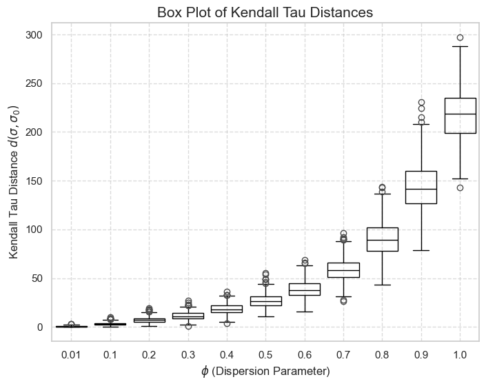

# Introduction

Welcome to the documentation for the [Mallows](https://github.com/Luiz-Lorena/Mallows.jl) package. It provides a function that can sample from Mallows Distribution for permutations.

# Mallows Model

The Mallows model is a probability distribution over permutations (rankings), defined by the following parameters:

*   **Central Permutation ($\sigma_{0}$):** This parameter represents the "mode" or the most likely permutation in the distribution.
*   **Dispersion Parameter ($\phi$):** This single scalar parameter ($0 < \phi \leq 1$) controls the concentration of the distribution around $\sigma_{0}$.
    *   $\phi$ close to 0: High consensus, samples are very close to $\sigma_{0}$.
    *   $\phi$ close to 1: Low consensus, approaches a uniform distribution (all permutations equally likely).
    This makes it easy to model varying degrees of agreement or noise in ranked data.

    The probability of a permutation sampling a permutation $\sigma$ from a Mallows Distribution defined by $\sigma_{0}$ and $\phi$ is given by:

```math
P(\sigma | \sigma_{0}, \phi) = \frac{ \phi^{d(\sigma, \sigma_{0})} } { Z(\phi) }
```

where:

* the Kendall Tau distance between $\sigma$ and $\sigma_{0}$ is defined as $d(\sigma, \sigma_{0})$.
* the denominator is a normalization constant $Z(\phi)$. 

!!! note
    The [Kendall Tau distance](https://en.wikipedia.org/wiki/Kendall_tau_distance) counts the number of pairwise disagreements between two ranking lists.

## Impact of the Dispersion Parameter ($\phi$)

The following figure shows the impact of the dispersion parameter $\phi$. 
- For $\phi = 0.01$ (close to 0), the sampled permutations will be very close to $\sigma_{0}$. The Kendall distances will be small, concentrated near 0.
- For $\phi$ closer to $1$, there will be more dispersion. Distances will be larger and more spread out.



## Importance and Applications of Mallows Model

The Mallows model, particularly with Kendall's Tau distance, holds significant importance across various fields due to its elegant mathematical properties and its ability to model distributions over permutations in a flexible and interpretable way:

*   **Machine Learning & AI:**
    *   **Rank Aggregation:** Combining multiple (noisy) rankings of items to find a consensus ranking (e.g., search engine results, recommendation systems).
    *   **Preference Learning:** Modeling user preferences for items.
    *   **Label Ranking:** A supervised learning task where the output is a full ranking of labels.
    *   **Metric Learning for Ranks:** Learning distance functions that align with observed ranking data.
*   **Statistics:**
    *   **Analysis of Ranked Data:** Used in social choice theory, voting analysis, sports rankings, and survey data where respondents rank options.
    *   **Non-parametric Statistics:** Provides a flexible alternative to simpler models for permutations.
*   **Bioinformatics:**
    *   **Gene Order Analysis:** Comparing the order of genes in different genomes.
*   **Information Retrieval:**
    *   Modeling user behavior and document relevance.
*   **Operations Research & Combinatorial Optimization:**
    *   Problems involving optimal orderings or sequences.
*   **Computer Vision:**
    *   Object tracking or matching features based on their relative order.

## Usage Example

```julia
using Mallows, Random

Random.seed!(42)

n = 5
phi = 0.5
sigma0 = [1, 2, 3, 4, 5]
sampled_permutation, kendall_distance = sample_mallows_kendall_tau(n, phi, sigma0)

println("Sampled permutation: $sampled_permutation | Distance: $kendall_distance")

```

## Citing Mallows.jl

If you find Mallows.jl useful in your work, we kindly request that you cite the
following paper ([preprint](https://arxiv.org/abs/2206.03866)):

```bibtex
@article{Lubin2023,
    author = {Miles Lubin and Oscar Dowson and Joaquim {Dias Garcia} and Joey Huchette and Beno{\^i}t Legat and Juan Pablo Vielma},
    title = {{JuMP} 1.0: {R}ecent improvements to a modeling language for mathematical optimization},
    journal = {Mathematical Programming Computation},
    year = {2023},
    doi = {10.1007/s12532-023-00239-3}
}
```